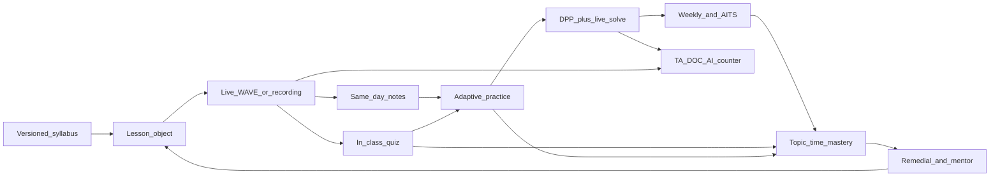

# Indian online education platforms — operational comparison

Focus: **how teachers and students actually work day to day**, not pricing, valuations, or campaign claims.

## Scope, segments, and assumptions

These nine names are **not the same product type**. Comparing them as if they all run “online classes” hides how they operate.

| Platform | Primary operating segment (as of documented products through 2025–2026) |
| --- | --- |
| BYJU’S | K–12 recorded visual learning + live tuition (BYJU’S Classes) + hybrid centres (BTC) + exam-prep via Aakash Digital |
| Vedantu | Live K–12 / JEE–NEET: 1:1, small group, and large WAVE batches |
| Unacademy | Live + recorded exam marketplace: UPSC, JEE, NEET, banking, SSC, CA, school boards |
| PhysicsWallah (PW) | YouTube → app batches → tests/DPPs → offline Vidyapeeth + hybrid Pathshala |
| Toppr | Adaptive practice + doubts-on-chat + live (Photon); later inside BYJU’S group |
| Adda247 | Govt-exam live batches + test series + PDFs + Telegram; Gradeup merged in |
| LEAD School | **School-embedded** curriculum + teacher tablet + parent/student apps (not B2C coaching) |
| Extramarks | **School smart class** + Learn–Practice–Test app + school-to-home recordings |
| upGrad (K–12 / exam-prep arm) | **Not a full K–12 school LMS.** Documented pieces: **upGrad Jeet** (exam-prep cohort + mentor + daily goals) and **upGrad School of Technology (SOT)** practice engine (JEE PYQs / chapter tests / analytics). Core upGrad DNA is **cohort + mentor + recorded + live + projects** for higher ed; exam-prep arms reuse that pattern, not LEAD-style school timetables. |

**Assumptions used throughout**

- Features vary by **SKU** (free YouTube vs paid batch vs Iconic vs school license). Flows below are the **paid / flagship** loop unless stated.
- Products, apps, and faculty models change often. This is an **operating-model** snapshot from public product docs, help centres, teacher-app descriptions, and 2024–2026 programme pages — not a guarantee of every screen in every city.
- “Teacher” means: **star faculty**, **batch tutor / TA**, **school teacher**, or **mentor**. Those jobs are different; mixing them is a common source of vague analysis.
- Depth of analytics and doubt SLAs is **claimed in product literature**; live class sizes of 2,000+ (Vedantu WAVE, Unacademy Plus) mean **personalisation is organisational (second teacher / mentor), not one tutor per child**, unless the SKU is 1:1.

---

## Snapshot: core model vs typical day

| Platform | Core model | Typical student day | Typical teaching / faculty day |
| --- | --- | --- | --- |
| BYJU’S TLA | Self-paced video + adaptive practice | Watch chapter video → in-video checks → Warm Up / Sprint / Race practice → report | Central content team; live SKU: concept teacher + doubt teacher |
| BYJU’S Classes / BTC | Hybrid two-teacher | Live/hybrid concept class → practice class → app homework → monthly test | Deliver scripted visual lesson; TAs run practice; mentors do PTMs |
| Vedantu WAVE | Live large group + multi-teacher | Join WAVE → polls/quizzes → TA doubts → homework/tests → parent report | Master teacher on whiteboard; class teachers/TAs in chat; post-class engagement dashboard |
| Vedantu 1:1 | Live small / 1:1 | Diagnostic → custom session → practice → parent update | Full pacing control; session notes; less central script |
| Unacademy Plus | Live large + recordings + tests | Batch live class → chat/raise hand → PDF → practice/mocks → Iconic: 8–10 min mentor call | Educator goes live from dashboard; slides/polls; stats; penalties/incentives |
| PW online batch | Live/recorded lecture + DPP + tests | Live or recording → notes → DPP → test/AITS → Ask AI / DPP discussion | Central academic plan; faculty lecture + evening DPP solve; counsellors on schedule |
| PW Pathshala | Hybrid two-teacher | Studio live on screen + room teacher → 8h doubt counters → AITS | Star faculty in studio; centre expert for doubts/mentorship |
| Toppr | Adaptive practice-first + DOC | Video or live → adaptive questions → photo doubt → test | Content/Q-bank teams; live via Photon; tutors on DOC queue |
| Adda247 | Test-series + live + community | Live (Mon–Sat pattern) → PDF → topic test → full mock + rank → Telegram doubts | Faculty live + weekend analysis; PDF/handouts; community replies |
| LEAD | School LMS + concentric classroom | School: teacher-led → group practice → individual practice; home: homework on Student App | Tablet lesson plan + AV; attendance; auto-grade MCQ; remedials from dashboard |
| Extramarks | Smart class + LPT app | Class on interactive content → home Learn/Practice/Test → recordings | Teaching App: content, homework, paper gen, scan-grade, parent ping |
| upGrad Jeet / SOT practice | Cohort + goals + AI practice | Daily goals → lecture/practice → doubt → mentor check-in | Mentors on goals/strategy; faculty on content; SOT: assessment engine more than live school teaching |

---

## 1. BYJU’S

**SKUs in one brand:** The Learning App (TLA); BYJU’S Classes (live two-teacher); BYJU’S Tuition Centre (BTC, hybrid physical); Aakash BYJU’S Live / Tablet (JEE–NEET). Do not treat them as one workflow.

### 1.1 Core model and operating style

- **TLA:** Primarily **self-paced interactive video** (long visual lessons, not 8-minute TikTok clips), plus **adaptive practice** and reports. Live is an add-on SKU.
- **BYJU’S Classes:** **Live large-group** with a **two-teacher model**: expert on high-quality video/visuals; second teacher for doubts and interactivity. Stated process: **Learn → Practice → Revise → Solve doubts**.
- **BTC:** **School-adjacent hybrid.** Virtual concept on large classroom display; in-room teacher for doubts, monitoring, worksheets. Mix of **2–3 days/week online** and **1–2 days/week at centre** (as described on BTC FAQs).
- **Aakash Digital:** Coaching **discipline** (timetable, printed modules, tests) + live/tablet recordings.

**Student learning day (TLA)**

1. Open chapter on app (often tablet-first historically).
2. Watch visual lesson with checkpoints.
3. Practice: **Warm Up → Sprint → Race** (difficulty ramp).
4. See real-time progress; parent-facing reports.

**Student learning day (Classes / BTC)**

1. Concept class (visual + expert).
2. Live practice class (second teacher breaks problems).
3. Homework on TLA.
4. Monthly tests, report cards, PTMs; assigned **mentor** for assignments and monthly evaluation (Classes product description).

**Teaching day**

- **TLA:** Individual school teachers do **not** author the library. Central **pedagogy + animation** teams ship modules. Live faculty follow a **cohort-customised** version of the same visual stack.
- **BTC classroom teacher:** Reinforcement, worksheet completion, engagement — not designing the 85-inch lesson from scratch.
- **Mentors:** Progress chasing, PTMs, homework compliance — distinct from “star teacher on video.”

### 1.2 Teacher features and workflow

- Tools: visual lesson player / large display; live class with second teacher; quizzes; homework on app; monthly reports; PTMs.
- Onboarding: productised lesson scripts + visual assets; BTC teachers trained to run **tech-enabled tuition**, not to invent curriculum.
- Control: **Low on content and assessments** for TLA/BTC. Pacing of the *library* is student-adaptive; pacing of *live batches* is cohort-scheduled.
- Sharing: App library; BTC worksheets; Aakash-style printed packs on exam SKUs. Little “teacher-to-teacher slide share” like Unacademy educators.

### 1.3 Student features and workflow

- Access: **App** (Android/iOS), historically **offline tablet packs**; BTC physical + app.
- Practice: Unlimited chapter practice; adaptive modes; video prompts on wrong answers.
- Doubts: In-class second teacher; app **instant Q&A / TeacherGPT-style** (Wiz / point-teach-and-bottom-out described in BYJU’S AI materials); BTC leftover doubts at centre.
- Feedback: Individual knowledge graph / BADRI-style **knowledge tracing** (interactions → predicted proficiency and forgetting); parent reports; monthly cards on live SKUs.

### 1.4 Content and material design

- Structure: **Long conceptual videos** with visual storytelling, then practice bundles — not “live-only.”
- Creators: Central teams + founder-style faculty recordings; Aakash faculty for entrance.
- Updates: Board/exam mapping in app; BTC “customised to cohorts.” Versioning is **platform-side**, not teacher-side.
- Sharing: In-app modules; not primarily printable DPPs (Aakash/PW are stronger on paper modules).

### 1.5 Engagement and accountability

- App: personalised journey, practice volume, notifications.
- Live/BTC: timetable, homework, monthly tests, **mentor**, PTMs.
- Disengagement: Mentor/parent reports more than in-class TA swarm (unlike Vedantu WAVE). TLA alone is **easy to go passive** (watch without practice).

### 1.6 Assessment and analytics

- Chapter practice, interactive tests, monthly tests (Classes/BTC), Aakash test cadence on exam SKUs.
- Teachers (live/BTC): class progress, who needs support — **not** Unacademy-style educator marketplace stats.
- Students/parents: strengths/weaknesses, time-on-app, suggested next content. **Predicted scores** appear in AI/knowledge-tracing narratives; treat as product intent, not verified exam oracle.

### 1.7 Strengths, weaknesses, best-of

**Strengths**

- Visual concept teaching that many students can follow without a live teacher.
- Explicit **Learn–Practice–Revise–Doubt** loop on Classes.
- Two-teacher split: content quality vs in-room/live doubt.
- Parent reporting culture (PTM, monthly cards).
- Adaptive practice modes (Warm Up / Sprint / Race).

**Weaknesses / friction**

- TLA over-reliance on **recorded video**; weak daily social accountability unless live/BTC.
- School teachers are **consumers** of content, not authors — poor fit if you need faculty-built PPTs.
- Multiple SKUs confuse “one BYJU’S day.”
- Large live groups still need the second teacher; without them, interaction collapses.
- Company/product instability (2024–2026) can break continuity of app features and centres.

**Best-of to copy**

1. Visual **concept module** designed for pause–practice–resume, not a Zoom recording of a blackboard.
2. **Two roles** in one class: explainer vs doubt/practice teacher.
3. Adaptive practice **difficulty lanes** after the same video.

---

## 2. Vedantu

### 2.1 Core model and operating style

- **Hybrid of live formats** on one stack (**WAVE** — Whiteboard Audio Video Environment): **1:1 tuition**, **small group**, and **large live** (product claims: 2,000+ in class; 10,000+ webinar).
- Large class uses **multi-teacher / master + class teacher / TAs**: master teaches; others resolve doubts in ~30–45s (company operational narrative).
- WAVE 2.0: **100+ real-time parameters** (face/engagement, whiteboard usage, verbal, doubt, sentiment — as claimed). Teachers **nudge** disengaged students; post-class engagement insights.

**Student day (large WAVE)**

1. Join scheduled live class on WAVE (app/web).
2. Interact: quizzes, fill-in, **tag/drag-drop**, polls, AR/gimmicks (star shower, etc.).
3. Chat / TA for instant doubt; master keeps lecturing.
4. Homework, chapter tests, mocks; **Ask Doubt** 24/7 (product pages).
5. Performance report; parent app (attendance, topic scores).

**Student day (1:1)**

1. Diagnostic / gap list.
2. Custom plan vs school syllabus.
3. Whiteboard problem-solving; pause anytime.
4. CBSE-type practice; quizzes; parent updates every few sessions.

**Teaching day (WAVE master)**

- Live on interactive whiteboard; watch engagement heatmap; send nudges; tailor mid-class if doubt trends spike.
- **Does not** personally answer every chat line.

**Teaching day (class teacher / TA)**

- Parallel doubt queue during the same lecture.

**Teaching day (1:1 tutor)**

- Full control of pace and examples; session-level assessment; less WAVE “nudge dashboard,” more human diagnosis.

### 2.2 Teacher features and workflow

- Daily tools: WAVE whiteboard, two-way A/V, polls/quizzes, drag-drop, TA doubt console, engagement dashboard, post-class reports, homework, parent updates.
- Breakout rooms: not the headline (Zoom-school style); scale is **TA parallelisation**, not 8 breakout rooms of 5.
- Onboarding: WAVE as teaching OS; large-class faculty trained to teach **to the dashboard**, not only to the camera.
- Monitoring: engagement metrics, class feedback, NPS-style scores (company claims high NPS — treat as brand metric).
- Control: Large batches — **central syllabus + master pacing**. 1:1 — **high teacher control**.
- Sharing: Digital notes, practice sets, recordings of live class, reports. Master decks are **platform/faculty assets**.

### 2.3 Student features and workflow

- Access: app/web; device-based live; recordings after class.
- Practice: assignments, chapter-wise tests, mocks, past papers (tuition pages).
- Doubts: in-class TA; 1:1 instant; 24/7 Ask Doubt; post-class insights.
- Feedback: per-class engagement + academic reports; parents see attendance and improvement areas.

### 2.4 Content and material design

- **Live-first**; recordings as catch-up. Notes + practice bundled around the class.
- Creators: Vedantu “master teachers” + 1:1 tutor pool. Central team for WAVE activities (quizzes, drag-drop objects).
- Updates: board/exam courses refreshed as SKUs; 1:1 can track **this week’s school chapter**.
- Sharing: in-app; not a school LMS for 800 partner schools (that is LEAD/Extramarks).

### 2.5 Engagement and accountability

- Live **calendar** is the spine.
- In-class: quizzes, nudges, “on stage” appreciation.
- Homework deadlines + tests.
- Low engagement: **real-time nudge** (WAVE) vs waiting for a term exam.
- Mentors vs teachers: large class **class teacher ≈ academic TA**; 1:1 tutor is both teacher and mentor. Separate counsellor less emphasised than Unacademy Iconic / PW counsellor.

### 2.6 Assessment and analytics

- In-class quizzes, homework, chapter tests, mocks.
- Teacher: live engagement, doubt trends, who to nudge.
- Student/parent: attendance, topic scores, next-focus areas.

### 2.7 Strengths, weaknesses, best-of

**Strengths**

- Best-in-set **live interaction design** (whiteboard + activity types).
- **Multi-teacher** so large class is not a webinar.
- Real-time **engagement instrumentation** (if it works as claimed).
- True **1:1 SKU** on the same brand for kids who fail in batches.
- Parent-visible session reports.

**Weaknesses / friction**

- Large WAVE still **not personalised curriculum** — only personalised *interventions*.
- Camera/face analytics raise **privacy and “performative attention”** issues.
- 1:1 vs group quality **varies by tutor**.
- App + live + homework stack can feel **busy** for younger students.
- Master teacher has **little time per student**; TA quality is the hidden variable.

**Best-of to copy**

1. **Master + parallel doubt teachers** in one live session.
2. **In-class micro-activities** (poll, drag-drop, instant quiz) every few minutes.
3. **Live engagement dashboard + nudge**, plus post-class report — not attendance-only.

---

## 3. Unacademy

### 3.1 Core model and operating style

- **Educator marketplace + structured Plus batches.** Free YouTube-like lessons exist; **Plus/Iconic** is the daily operating system: **daily live classes**, chat, polls, **raise hand (audio)**, PDFs, practice, mocks.
- Iconic: **1:1 live mentorship** (help centre: typically **~8 minutes + optional 2**, audio + optional whiteboard; strategy/plan/doubt; sessions credited ~twice/month on some goals). Mentors are often **not** the star educator (GATE Iconic FAQ: mentors ≠ educators; academic doubts still go to class educators).
- Batch sizes are **large**. Personalisation is **Iconic mentor + priority doubt**, not small-group pedagogy.

**Student day (Plus)**

1. Open goal (NEET, UPSC, etc.) → today’s live / planner (upcoming, missed, completed).
2. Live: watch educator video + slides; chat; polls; optional raise hand if educator enabled.
3. Download **class PDF**; later watch recording; offline download on app.
4. Practice section + course quizzes + test series.
5. Iconic: book mentor slot (Android/web; iOS historically limited).

**Teaching day (educator)**

- Web **Educator Dashboard** + **Educator App**: schedule, go live, slides, chat, doubts, raise-hand queue, quizzes, live learner count, class statistics, referrals, alerts.
- **Live Support** team for chroma, pen-tab, go-live failures.
- Onboarding/contracts; **penalties** exist as a support category (missed class / policy).
- Special classes vs Plus batches: more **educator-authored** courses vs **batch syllabus** owned with Unacademy.

### 3.2 Teacher features and workflow

- Tools: live interface, slides, chat, doubts, raise hand, polls/quizzes, recordings, PDFs, test attach, stats.
- No school-style homework markbook for 40 children; this is **exam cohort** teaching.
- Control: High on **Special Classes** and educator courses. Plus batches: **shared calendar**, still educator-led live. Assessments: platform test series + educator DPPs.
- Sharing: **PDF per lesson**, recordings, course page. Educators do not sit in a school “shared drive of lesson plans” like LEAD.

### 3.3 Student features and workflow

- Access: app + web; **download lessons**.
- Practice: in-platform practice, weekly quizzes, mocks; DPP discussion classes common in GATE/JEE batches.
- Doubts: chat; raise hand (Plus/Iconic, educator can disable); doubt classes; Ask a doubt (pre-recorded mentor video vs 1:1 — help centre distinction); Discord mentioned for some Iconic mentor contact.
- Feedback: class-level polls; test analytics; Iconic mentor on **study plan**, not a full school report card.

### 3.4 Content and material design

- **Long live lectures** (often 60–90+ min) that become recordings; PDF notes; physical material on some Iconic batches.
- Creators: **star educators** (personal brand). Central team: platform, tests, batch packaging.
- Updates: new batches per exam cycle; educator can run extra specials on pattern change.
- Sharing: in-app library per goal; PDFs; some books.

### 3.5 Engagement and accountability

- **Daily live calendar** + “missed class” list.
- Subscription access to **many educators** can **dilute** a single path (student hops between teachers).
- Iconic mentor = accountability call, not daily homework nag like LEAD parent app.
- Disengagement: completion/watch stats on educator dashboard; human follow-up depends on SKU.

### 3.6 Assessment and analytics

- Quizzes in class, topic tests, full mocks, PYQs in batches.
- Educator: live count, engagement, class statistics — **growth/referral oriented** as well as teaching.
- Learner: test scores, plus mentor qualitative plan. Weaker **parent heatmap** than LEAD/Extramarks/Vedantu K–12.

### 3.7 Strengths, weaknesses, best-of

**Strengths**

- Star-faculty **live at national scale** with a real educator console.
- **Raise hand** as a scarce, teacher-gated speaking slot (not infinite chat).
- Recordings + PDFs + tests in one subscription.
- Iconic **splits academic teacher vs strategy mentor**.
- Goal taxonomy covering **200+ exams** (operating breadth).

**Weaknesses / friction**

- Large batches; raise hand is a **lottery**.
- Students can **over-consume live hours** without a forced practice loop (weaker than PW DPP or Toppr adaptive).
- Educator **incentive/penalty** culture can bias toward watch-time, not mastery.
- Mentorship slots are **short** (8–10 min).
- iOS gaps on some mentor features (as documented).

**Best-of to copy**

1. **Educator OS**: go-live, slides, gated raise-hand, class stats, live support.
2. **Lesson PDF + recording** as default artefacts of every live.
3. **Mentor ≠ lecturer** with booked strategy sessions.

---

## 4. PhysicsWallah (PW)

### 4.1 Core model and operating style

- **YouTube-native teaching** productised into the **PW App**: enrolled **batch** = timetable in **Announcements**, live + recordings, **lecture-wise notes**, **topic assignments / DPPs**, **test series**, notifications.
- **Pi**: academic **OTT** (recorded, playlists, Ask AI, DPPs, tests) for self-paced.
- **Vidyapeeth:** full offline classroom.
- **Pathshala:** **two-teacher hybrid** — star faculty **live from studio** on smart screen; **offline expert** in room for doubts/mentorship; **8-hour** subject-wise doubt counters; AITS; milestone tests ~21 days (2026 Pathshala materials).
- 2026: **Live DPP solving** in the evening (quiz-style), because recorded DPP solutions were **procrastinated**. Power batches: primary lecture teacher + secondary doubt teacher.

**Student day (online batch)**

1. App → batch → announcement/timetable.
2. Attend live **or** watch recording (Hinglish, board + notes).
3. Download/share **lecture notes**.
4. Solve **DPP** / topic assignment.
5. Evening **live DPP** (if in programme) or recorded solutions.
6. Scheduled tests, Rank Booster, **AITS**; open analysis on app.
7. Stuck: **Ask AI**, DPP discussion, counsellor.

**Student day (Pathshala)**

1. Sit in smart classroom; watch studio live; room teacher handles local doubts.
2. After class: counters for 8 hours; modules + DPPs; app recordings/notes.
3. Offline tests + AITS; parent–student dashboard.

**Teaching day**

- **Star faculty:** high-volume live/studio teaching; notes aligned to lecture; DPP discussion slots.
- **Doubt faculty / Pathshala T2:** all-day problem solving, not content creation.
- **Academic team:** batch planner, modules, AITS.
- **Counsellor:** timetable, admissions, “where is the schedule” — not the same as faculty.

### 4.2 Teacher features and workflow

- Student-facing: live player, notes, DPP, tests. Faculty-facing public docs emphasise **content + live + doubt**, not a LEAD-style teacher markbook for a school section of 40.
- Control: **Central batch curriculum** (Arjuna/Lakshya naming, lecture planner). Faculty are famous but **do not each invent the year’s sequence**.
- Sharing: notes download/share; modules in print; recordings on app; DPP answer keys/videos.

### 4.3 Student features and workflow

- Access: PW App; YouTube (top of funnel); offline centres; Pi subscription; printed modules.
- Practice: **DPP-first**, chapter tests, mocks, AITS, battleground/real-test style modes (app release notes).
- Doubts: live chat (limited), Ask AI (during lecture on Pi), live DPP, 8h centre, community.
- Feedback: test analysis, report cards (offline), parent dashboard (Pathshala).

### 4.4 Content and material design

- **Long lectures** (YouTube grammar: 60–120 min) + **handwritten-style notes** + **DPP**.
- Creators: named faculty + academic ops. AI mentor trained on **PW lecture corpus** (shareholder-letter style claim).
- Updates: new target-year batches (e.g. Arjuna NEET 2027); syllabus notes in announcements.
- Sharing: app library + **physical modules** (stronger than Vedantu-only digital).

### 4.5 Engagement and accountability

- Batch **calendar** + notifications + counsellor.
- DPP + live DPP = **daily practice habit**.
- AITS calendar = national peer pressure.
- Mentors as **Margdarshaks** at Pathshala (planners, emotional support) vs academic star on screen.

### 4.6 Assessment and analytics

- DPP, chapter tests, milestone tests, AITS, rank boosters.
- Teachers at centre: who came to doubt counter, test report cards.
- App: video solutions + test analysis; weaker public detail on **class heatmaps** than Vedantu WAVE.

### 4.7 Strengths, weaknesses, best-of

**Strengths**

- Tight **lecture → notes → DPP → test** coaching loop.
- Recordings as **first-class**, not an afterthought (working students/school-goers).
- **AITS** as shared national ritual.
- Pathshala: studio quality + **physical doubt labour**.
- Live DPP to kill **solution-video backlog**.

**Weaknesses / friction**

- Online live is still **large-batch**; Ask AI ≠ human physics intuition.
- Announcement-based timetable is **clunky** vs a proper calendar OS.
- Faculty load; quality of **T2 doubt teachers** varies by centre.
- App complexity (live, Pi, community, tests, 1-1, mentorship — release notes show many modules).
- School-board integration weaker than LEAD (this is coaching, not the school day).

**Best-of to copy**

1. **DPP as a daily artefact** with a **live solve slot**, not only a PDF.
2. **Lecture-wise notes** downloadable the same day.
3. **Two-site teaching**: broadcast faculty + local doubt capacity.

---

## 5. Toppr

**Assumption:** Distinctive product was **adaptive practice + Doubts on Chat (DOC) + Photon live**. After BYJU’S acquisition, SKUs may be folded; the **operating ideas** below are Toppr’s, not current store-listing guarantees.

### 5.1 Core model and operating style

- **Practice-first hybrid:** videos + live (Photon: polls, quizzes, classboard, chat) + **ML question recommendation** from a multi-million item bank + **24/7 doubts**.
- Founders’ stated insight: students spend ~**70% of time practising**; each child needs a **different next question**.

**Student day**

1. Learn: short/medium videos or Photon live.
2. Practice: each next item from **attempt history + accuracy**.
3. Doubt: **photo of question** → AI match in database → else **human tutor ~60s** (company narrative).
4. Tests/mocks; analytics on strength/weakness and **time-per-question**.

**Teaching day**

- Live teachers on Photon (used at scale in schools in 2020+).
- DOC tutors: **queue-based** solving, not owning a class section.
- Central teams: Q-bank, videos, adaptive models.

### 5.2 Teacher features and workflow

- Photon: video/audio, polls, quizzes, classboard, chat.
- DOC tutors: incoming tickets, not lesson plans.
- Control: live class may follow a schedule; **practice path is algorithm-owned**.
- Sharing: platform library; tutors do not typically ship personal DPP series like PW faculty.

### 5.3 Student features and workflow

- Access: app/web.
- Practice: **adaptive sets**, topic tests, mocks; 22+ boards / 60 exams (company narrative).
- Doubts: DOC hybrid AI + human.
- Feedback: skill maps, time-sink vs concept-error (later AI-exam discourse).

### 5.4 Content and material design

- Videos + huge **question graph**, not live-only.
- Creators: internal + SME pool.
- Updates: exam/board tags; personalisation by **performance**, not by teacher playlist.
- Sharing: in-app; school Photon embeds.

### 5.5 Engagement and accountability

- Next-question loop (game-like).
- Weaker **live calendar identity** than Unacademy/PW unless student joins live.
- No strong mentor layer in the original DNA (unlike Iconic/Jeet).

### 5.6 Assessment and analytics

- Adaptive tests, chapter tests, mocks.
- Teacher (school Photon): live polls/quizzes.
- Student: mastery by topic, recommended path.

### 5.7 Strengths, weaknesses, best-of

**Strengths**

- Best-in-set **adaptive next question**.
- DOC: **photo doubt** with AI triage + human fallback.
- Practice time treated as the **main product**.
- Multi-board question tagging.

**Weaknesses / friction**

- Live teaching never as culturally central as Vedantu/Unacademy.
- Adaptive can feel **lonely** (no batch mates).
- DOC quality depends on tutor pool and AI match rate.
- Brand/product absorbed — continuity risk.

**Best-of to copy**

1. **Every practice item chosen from history**, not a static PDF of 50 Qs.
2. **Photo-to-solution** pipeline with human escalation.
3. Distinguish **slow-but-correct** vs **concept-wrong** in analytics.

---

## 6. Adda247

### 6.1 Core model and operating style

- **Govt-exam OS:** live batches **+** huge **test series** **+** PDFs/e-books **+** current affairs **+** **Telegram/community**. Gradeup heritage = tests; Adda247 heritage = teachers + bilingual + YouTube.
- Example banking foundation SKU: **Mon–Sat ~1 hour/subject alternate days**; **Saturday** seminars/AMA; **Sunday** weekly topic tests + **faculty analysis**; **private Telegram** with faculty, ex-bankers, batchmates; physical **Ace series** books; 10 full mocks with ranking.

**Student day**

1. Live class (two-way as advertised) or recording.
2. Lecture PDF / handwritten notes.
3. Topic assignment.
4. Quiz / sectional / full mock (often **memory-based** after real exam).
5. Rank/percentile; video solutions.
6. Doubts: live, app, **Telegram**, some **offline centres**.

**Teaching day**

- Live teaching + **weekend analysis class** (walk through the weekly test).
- PDF/handout production.
- Community answering (high volume, uneven quality).
- Less “school homework dashboard”; more **exam calendar**.

### 6.2 Teacher features and workflow

- Live class tools (platform-dependent), PDFs, test attachment, Telegram.
- Control: batch syllabus central; faculty own **tricks/notes** culture.
- Sharing: PDFs, e-books, books, YouTube clips, Telegram files — **multi-channel**, not one LMS.

### 6.3 Student features and workflow

- Access: app/web; offline downloads; **printed kits**; 12+ languages on some live SKUs.
- Practice: topic, sectional, full mocks, PYQ, **live tests** with All-India rank (Testbook is often sharper on this UX; Adda247 still test-heavy).
- Doubts: class + Telegram + centres.
- Feedback: score, rank, section accuracy; current-affairs cadence.

### 6.4 Content and material design

- Live + short current-affairs formats + **exam-pattern mocks**.
- Creators: named SSC/banking faculty + test teams.
- Updates: **pattern change within weeks** (memory-based mocks).
- Sharing: PDF-first; books; app tests.

### 6.5 Engagement and accountability

- Daily class + **Sunday test ritual**.
- Telegram FOMO / peer questions.
- Mahapacks = access sprawl (can overwhelm).
- Mentors: batch community + ex-bankers, not LEAD academic coordinator.

### 6.6 Assessment and analytics

- Deep **mock ecosystem**; analysis sessions.
- Teacher: more **discuss this paper** than heatmap of 40 school kids.
- Student: rank, weak section, time — **Testbook often cited as cleaner analytics UI**; copy the *idea* of **post-mock one-screen analysis**.

### 6.7 Strengths, weaknesses, best-of

**Strengths**

- **Test-series density** and exam-pattern speed.
- **Weekly test + faculty debrief** as a habit.
- Bilingual + community layer.
- Physical book kits alongside live.
- Memory-based mocks after real papers.

**Weaknesses / friction**

- Telegram is **not an LMS** (search, moderation, lost files).
- Live quality < Vedantu WAVE interaction design.
- Analytics UX often **second** to Testbook.
- Easy to **collect PDFs** without mastery.
- K–12 school pedagogy is not the job.

**Best-of to copy**

1. **Sunday (or weekly) test + same-week analysis class.**
2. **Mock → rank → section heat → video solution** in one loop.
3. **Exam-week speed**: memory-based paper within days.

---

## 7. LEAD School

### 7.1 Core model and operating style

- **B2B school system:** curriculum, books, activity kits, **teacher tablet** (cast to TV), **Teacher App**, **Student/Parent App**, **School App**, assessments, **teacher training**. Target: affordable private schools, often smaller cities.
- Pedagogy: **Concentric learning** — **Teacher-led → Group practice → Individual practice**, then assessments and **remedials** before the next concept.
- Offline-first: content on **SD card / tablet** so class survives **no internet**.

**Student day (in school)**

1. Teacher opens **today’s lesson plan** on tablet, plays mapped AV.
2. Group activity (kits).
3. Individual practice.
4. Quiz/assessment when scheduled.
5. If failed concepts: **remedial** list from app.

**Student day (home)**

1. Student App: homework, e-books, recorded/live as enabled, submit assignments.
2. Parent section: attendance, classwork, homework, progress.

**Teaching day**

1. Check **timetable** on Teacher App.
2. Pre-read lesson plan + **microtraining video** per unit.
3. Coordinator may **quiz the teacher** on the plan (KURPC / check-your-preparation).
4. Teach from tablet; attendance; homework assign.
5. Assessments: schedule unit tests; **objective auto-check**; **subjective mark entry**; see pending submissions and **students needing remedials**.
6. **Classroom observation** by Academic Coordinator with rating/feedback.
7. Nucleus/ERP for summative exams (unit tests teacher-scheduled; other exams on nucleus — teacher help centre).

### 7.2 Teacher features and workflow

- Daily: lesson plans, AV, attendance, homework, assessments, marks, messaging, timetable.
- **Not** a personal YouTube studio. **High scaffolding, low content authorship.**
- Training: LEAD Academy workshops; coordinator observations.
- Control: **Central curriculum.** Teacher chooses **some assessment customisation** (topic & rigour — marketing) but not a parallel syllabus.
- Sharing: school-wide lesson objects; not faculty PDF brands.

### 7.3 Student features and workflow

- Access: classroom + Student App; workbooks; kits.
- Practice: in-class individual practice, home practice, quizzes.
- Doubts: **classroom teacher** (primary). App is homework, not PW Ask AI.
- Feedback: attendance, scores, parent app, remedials.

### 7.4 Content and material design

- **Lesson-plan packages** (AV + kit + teacher script), not 2-hour JEE lectures.
- Creators: LEAD central academic teams.
- Updates: board/NCF-aligned system rollouts to all partner schools.
- Sharing: tablet/SD + print books.

### 7.5 Engagement and accountability

- **School timetable** (strongest daily habit in this list).
- Homework notifications.
- Coordinator + parent app.
- Mentors: **Academic Coordinator** coaches **teachers**; school counsellor if any is school-run, not a Plus mentor.

### 7.6 Assessment and analytics

- Unit tests, objective/subjective, online exams, remedials, attendance.
- Teacher: submissions, marks, remedial names, class/subject filters.
- Parent: progress and attendance — **school report**, not JEE predicted rank.

### 7.7 Strengths, weaknesses, best-of

**Strengths**

- Best **school-day operating system** for teachers.
- Concentric **teach → we-do → you-do → test → remedial**.
- Offline tablet reliability.
- Teacher **observation + prep checks** (actual QA).
- Parent–school loop on homework/attendance.

**Weaknesses / friction**

- Teachers can feel **scripted**; weak for star-faculty branding.
- Not built for **NEET AITS** or 2,000-person live.
- Hardware lock-in (documented Lenovo model constraints on older Teacher App listings).
- Remedials only work if teachers **use the data**.
- Student app engagement after school varies widely.

**Best-of to copy**

1. **Lesson plan + AV + activity kit + microtraining** as one object.
2. **Auto-list of remedial students** after each test.
3. **Coordinator observation** of teachers, not only student NPS.

---

## 8. Extramarks

### 8.1 Core model and operating style

- **Smart Class Plus in school** + **Learning App at home** + **Teaching App** + **Assessment Centre**. Pedagogy slogan: **Learn → Practice → Test**.
- Classroom: interactive content, whiteboard, optional virtual class, **lecture recording** pushed to students.
- Home: animations, virtual labs, in-video quizzes, **Score Booster**, NCERT Qs, **create-your-own test**, PYPs.

**Student day**

1. School: teacher plays Smart Class module; in-class checks.
2. Home: open same chapter — **Learn** (animation) → **Practice** (power questions, brain teasers) → **Test**.
3. Watch **today’s class recording** if missed/weak.
4. Notifications for homework deadlines.

**Teaching day**

1. Teaching App: attendance, content, homework, recordings.
2. Assessment: question bank, **auto paper generation**, **Power Questions** (variant items per student), online grade + **scan offline OMR/sheets**.
3. Dashboards: time-per-question, Bloom’s taxonomy reports (product claim).
4. Parent/student notifications.

### 8.2 Teacher features and workflow

- Tools: content library, whiteboard, polls, homework, paper setter, AI grading, recordings, admin.
- Control: **more assessment authorship** than LEAD (custom papers) but **content library is central**.
- Sharing: recordings + assigned practice; school admin panel.

### 8.3 Student features and workflow

- Access: school hardware + consumer Learning App (also JEE/NEET marketing on Play Store).
- Practice: very large Q-bank; video solutions; custom tests.
- Doubts: in class; app tools as licensed; not Telegram-primary.
- Feedback: accuracy, efficiency, comprehension-style reports, recommendations.

### 8.4 Content and material design

- **Short-to-medium animated modules** + virtual labs + game-like checks.
- Creators: Extramarks content factory mapped to boards.
- Updates: curriculum packs to schools; Power Questions for item variation.
- Sharing: LMS + printable papers (create online, conduct offline).

### 8.5 Engagement and accountability

- School timetable + **homework reminders**.
- Gamified practice.
- Parent notifications.
- Less “mentor call,” more **teacher + parent app**.

### 8.6 Assessment and analytics

- Strongest **assessment factory** in this set: templates, auto-gen, scan-grade, Bloom reports, time-on-item.
- Teacher: class and student reports across tests/quizzes/assignments.
- Student: LPT progress, exam readiness.

### 8.7 Strengths, weaknesses, best-of

**Strengths**

- **School-to-home recording** of *their* teacher, not a celebrity.
- LPT as a **visible three-tab student UI**.
- Assessment Centre (paper gen + scan + AI grade).
- Power Questions / anti-copy variants.
- Time-per-question analytics.

**Weaknesses / friction**

- Smart class can become **video babysitting** if teacher doesn’t facilitate.
- Consumer app vs school license **feature split**.
- Weaker live-coach culture than Vedantu/PW.
- Bloom dashboards unused if teachers aren’t trained (LEAD is stronger on training QA).
- JEE/NEET on the same brand is a **different motion** than Class 6 animation.

**Best-of to copy**

1. **Learn / Practice / Test** as the student home screen.
2. **Record this classroom → appear in that child’s app tonight.**
3. **Create online, conduct offline, scan to grade.**

---

## 9. upGrad (K–12 / school & exam-prep arm)

### 9.1 Core model and operating style

**Be precise:** upGrad’s core business is **higher education and professional upskilling** (cohorts, university partners, mentors, recorded + live, projects, career support). It is **not** LEAD or Extramarks.

Documented exam-adjacent pieces:

- **upGrad Jeet:** exam-prep product language — daily/weekly **goals**, notifications, **1:1 mentorship**, 24/7 doubts, revision modules, personalisation, “guided tour” by level, lots of questions from basics to exam level.
- **upGrad School of Technology:** **AI practice engine** for engineering entrances — **PYQs**, chapter/subject tests, performance trends, time insights, peer ranking; timed mocks described as roadmap; **uGNET** as *their* entrance test for B.Tech admissions — **not** a Class 11 NEET classroom.

**Student day (Jeet-style exam prep — as described)**

1. See **today’s goals**.
2. Lecture / module.
3. Question solving at current level.
4. Doubt anytime.
5. Mentor checks plan/consistency.

**Student day (SOT practice)**

1. Pick exam (JEE Main etc.).
2. PYQ or chapter test.
3. Read analytics (subject weak areas, time).
4. Next recommended practice (adaptive claims).

**Teaching / staff day**

- **Mentors:** goals, reminders, strategy (upGrad-like).
- **Faculty:** content and doubts (Jeet).
- **SOT:** more **assessment product** than live school teacher OS.

### 9.2 Teacher features and workflow

- Unacademy-like educator studio is **not** the public SOT story.
- Mentors use booking/goal dashboards (Jeet description).
- Control: programme team owns path; mentor personalises **effort**, not NCERT chapter order for a school.

### 9.3 Student features and workflow

- Access: web/app per product.
- Practice: high volume Qs (Jeet); PYQ engine (SOT).
- Doubts: 24/7 claim (Jeet); SOT is practice-first.
- Feedback: goal completion + mentor; SOT graphs and ranks.

### 9.4 Content and material design

- Mix of recorded, live, revision capsules, question banks.
- Creators: upGrad academic + partner faculty; SOT assessment content.
- Updates: exam-year and uGNET cycle.
- Sharing: platform modules; not school print kits.

### 9.5 Engagement and accountability

- **Goals + reminders + mentor** (strongest upGrad import).
- Weaker live-batch culture than PW/Unacademy unless Jeet batch is active.
- No school attendance OS.

### 9.6 Assessment and analytics

- SOT: PYQ, chapter/subject, trends, time, ranking.
- Jeet: continuous question practice + mentor qualitative.
- Not Bloom-in-school or WAVE face heatmaps.

### 9.7 Strengths, weaknesses, best-of

**Strengths**

- **Mentor + daily goals** (adult-learner accountability applied to exam prep).
- SOT: **PYQ-true** practice with analytics.
- Levelled “guided tour” (Jeet) vs dumping all lectures at once.
- Revision modules as a **named** layer.

**Weaknesses / friction**

- **Fragmented / thin K–12 footprint** vs the other eight.
- Risk of importing **MBA-cohort UX** that doesn’t fit Class 9.
- Live class interaction not a documented WAVE competitor.
- School timetable, parent homework, teacher observation: **missing**.
- SOT practice ≠ full coaching (no Pathshala doubt counter).

**Best-of to copy**

1. **Daily/weekly goals with a human mentor** who is not the lecturer.
2. **Diagnostic → levelled path** (“guided tour”).
3. **PYQ engine** with time and subject analytics (SOT).

---

## Cross-platform matrix: who is best at each *level*

Use this when designing; do not pick one vendor as universally “best.”

| Operational level | Best reference | What to copy | Weakest typical pattern |
| --- | --- | --- | --- |
| Live class interaction | Vedantu WAVE | Whiteboard, micro-quizzes, drag-drop, TA swarm, nudges | Webinar with chat only |
| Educator go-live OS | Unacademy | Dashboard, raise hand, live support, stats | “Here’s a Zoom link” |
| Visual self-paced concept | BYJU’S TLA | Story-visual module + practice lanes | 2-hour unedited board recording as the only Learn tab |
| Daily practice habit | PW | DPP + live DPP + notes same day | “Download 200 PDFs” |
| Adaptive practice | Toppr | Next-question ML + time-vs-concept | Same worksheet for all |
| Photo / async doubt | Toppr DOC | AI match then human | WhatsApp group only |
| Test-series ritual | Adda247 (+ Testbook UX) | Weekly test + debrief + rank + memory mocks | Tests with no analysis class |
| School teacher OS | LEAD | Plan, tablet, attendance, remedial list, coordinator QA | Coaching app forced on school teachers |
| School-to-home continuity | Extramarks | Tonight’s recording + LPT tabs | School and coaching as two disconnected worlds |
| Assessment factory | Extramarks | Auto paper, scan-grade, item variants | Teachers typing tests in Word every week |
| Hybrid two-teacher (physical) | PW Pathshala / BTC | Studio or video + in-room expert | Video in hall with no T2 |
| Mentor ≠ teacher | Unacademy Iconic / upGrad Jeet | Short strategy calls, goals | Lecturer also doing 200 counselling calls |
| Parent school loop | LEAD / Vedantu K–12 | Attendance, homework, topic scores | Rank PDF once a term |
| Offline classroom resilience | LEAD | SD/tablet lesson | Live-only class dies with Wi-Fi |
| Broadcast + local doubt labour | PW Pathshala | 8h counters | National live, zero local help |

---

## Ideal platform synthesis

### Design principle

One product with **roles**, not one hero teacher doing everything:

| Role | Job | Inspired by |
| --- | --- | --- |
| Concept faculty | Live or recorded explanation | PW / Unacademy / BYJU’S visuals |
| Class / doubt teacher | Parallel live doubts, practice hour | Vedantu TA / Pathshala T2 / BTC |
| School/section teacher | Attendance, homework, remedials | LEAD |
| Mentor | Goals, schedule, emotion, parent | Iconic / Jeet / PW Margdarshak |
| Assessment engine | Adaptive Qs, mocks, scan papers | Toppr + Extramarks + Adda247 |
| Academic ops | Versioned syllabus, AITS calendar | PW / Aakash |

### Ideal **student** experience

**Home screen (Extramarks LPT + LEAD homework + PW batch calendar)**

- **Today:** 1 live/concept block, 1 practice block, 1 short test or DPP, homework due, optional mentor ping.
- Tabs: **Learn | Practice | Test | Doubts | Reports**.

**Learn**

- If live day: **WAVE-like** class (polls every 5–7 min, TA chat). Recording auto-lands (Extramarks).
- If async day: **BYJU’S-like** visual module **or** PW lecture + **same-day notes**.

**Practice**

- Default: **Toppr adaptive** from *this* lesson’s concept graph.
- Coaching programmes: **PW DPP** due tonight; **live DPP** slot.

**Test**

- Micro-quiz in class (Vedantu).
- Weekly part test + **Sunday analysis** (Adda247).
- Term/AITS full mock + rank (PW).
- School unit test: teacher-scheduled, **scan-grade** (Extramarks), **remedial auto-list** (LEAD).

**Doubts**

1. In-class TA / raise-hand (Vedantu / Unacademy).
2. Photo/DOC + AI then human (Toppr).
3. Ask-while-watching (PW Pi).
4. Centre counter hours if hybrid (Pathshala).
5. Not only Telegram.

**Reports**

- Student: topic mastery, time-sink vs misconception (Toppr), suggested next 3 items.
- Parent (K–12): attendance, homework, last quiz (LEAD/Vedantu).
- Exam: predicted band only with **mock history**, not a magic AI score.

### Ideal **teacher** experience

**Depends on role — do not give a school teacher an Unacademy creator dashboard and call it done.**

**A. School / section teacher (LEAD spine)**

- Open timetable → lesson object (plan + AV + kit clip + 4-min microtraining).
- Teach concentric: I do / we do / you do.
- Assign homework in one tap; MCQs auto-grade.
- After unit test: **remedial roster**; record class to student app.

**B. Live concept faculty (Unacademy + WAVE)**

- Go-live checklist + live support.
- Slides/whiteboard; **gated raise hand**; polls.
- See engagement heatmap; TAs own chat.
- Class auto-exports: recording, PDF notes, DPP, quiz stats.

**C. Doubt faculty**

- Queue: live chat, DOC photos, DPP comments.
- SLA timer (Vedantu 30–45s narrative as a *target*, not a slogan).

**D. Mentor**

- Booked 10-min audio + whiteboard (Iconic).
- Sees **goals missed**, tests skipped, watch-without-practice (Jeet + BYJU’S loop).
- Does not re-teach TCA cycle unless tagged academic.

**QA (LEAD)**

- Coordinator observes live or classroom; scores facilitation, not just completion %.

### Sample **student** day (exam-prep + school, Class 11 NEET)

```text
06:45  Parent app: attendance marked yesterday; Bio homework due 20:00
07:30  School (LEAD-style): Biology period — tablet lesson + group + 8 MCQs
16:00  Coaching live (WAVE/PW): Neural control — polls + TA doubts
17:30  Notes auto-available; 12-Q adaptive set (Toppr) on “synapse”
19:00  Live DPP 20 min (PW) — 5 PYQs
19:30  Photo doubt on Q4 (DOC) — AI + human 2-min video
20:00  Submit school homework
Sunday  AITS mock + 45-min analysis class (Adda247/PW)
Fortnight Iconic/Jeet mentor: 8 min on timetable vs backlog
```

### Sample **teacher** day (three people, one “platform”)

```text
School teacher
  08:00  Microtraining + lesson plan check with coordinator
  08:40  Teach; attendance; assign Practice tab items
  14:00  Marks entry for subjective; open remedial list (6 names)
  16:00  Parent messages on two absences

Live faculty
  15:30  Go-live support; load slides
  16:00  90-min class; TAs on chat; export PDF+DPP
  17:40  Tag 3 items for tomorrow’s live DPP

Doubt teacher
  16:00–18:00  Live TA
  18:00–20:00  DOC + DPP comments + centre counter

Mentor
  20:00–21:00  Six 10-min slots: skipped tests, not content
```

### How content, live, practice, tests, doubts, analytics flow together



---

## Per-platform flow (student)

### BYJU’S TLA

`Open chapter → visual lesson + checkpoints → Warm Up/Sprint/Race → knowledge-graph report → (optional) live two-teacher / BTC worksheet`

### Vedantu WAVE

`Calendar join → master whiteboard + micro-activities → TA doubts/nudges → homework/test → parent engagement report`

### Vedantu 1:1

`Diagnostic → custom session on WAVE → instant doubt → quiz → parent update`

### Unacademy Plus

`Goal planner → live slides/chat/raise-hand → PDF+recording → practice/mocks → (Iconic) 8-min mentor`

### PW online

`Batch announcement → live or recording → notes → DPP → live DPP/Ask AI → AITS analysis`

### PW Pathshala

`Studio live on screen + room teacher → 8h doubt counter → modules/DPP → milestone/AITS → parent dashboard`

### Toppr

`Video or Photon live → adaptive next questions → photo DOC → mock → skill map`

### Adda247

`Mon-Sat live → PDF → topic drill → Sunday test → faculty analysis → Telegram leftover doubts → full mocks/rank`

### LEAD

`School timetable → tablet lesson → group → individual → test → remedial list → Student App homework → parent attendance`

### Extramarks

`Smart class module → in-class checks → home Learn/Practice/Test → class recording → paper/scan assessments → Bloom/time reports`

### upGrad Jeet / SOT

`Jeet: daily goals → module/Qs → 24/7 doubt → mentor`  
`SOT: PYQ/chapter test → analytics → next practice`  
`Neither replaces a school OS.`

---

## Per-platform flow (teacher / faculty)

### BYJU’S

`Central content ships modules → live/BTC teacher runs scripted visual + doubt role → mentor owns PTM/homework`

### Vedantu

`Master teaches to WAVE metrics → TAs clear queue → 1:1 tutor owns pacing → reports to parent`

### Unacademy

`Dashboard go-live → teach → gated interaction → stats/penalties/incentives → PDFs/tests attached`

### PW

`Academic planner → star lecture → notes/DPP ops → doubt faculty/live DPP → counsellor on logistics`

### Toppr

`Q-bank/adaptive team → Photon live teacher → DOC tutors on tickets`

### Adda247

`Live faculty → PDF → weekend paper discussion → community answers`

### LEAD

`Coordinator prep check → teach from plan → attendance/homework → auto-grade + mark entry → observation → remedials`

### Extramarks

`Play library → record class → assign LPT → generate/scan papers → read dashboards → notify parents`

### upGrad exam-prep

`Programme path → faculty content → mentor goals → SOT assessment engine`

---

## Closing: what an ideal edtech product should not mix up

1. **School OS** (LEAD/Extramarks) vs **coaching OS** (PW/Unacademy) vs **practice OS** (Toppr) vs **visual library** (BYJU’S TLA). The ideal product **layers** them; it does not pretend one app is all four.
2. **Star faculty** should not be the homework policeman; **mentors/coordinators** should.
3. **Live** without a **same-day practice artefact** (DPP/adaptive set) recreates webinar theatre.
4. **Analytics** without a **remedial action** (LEAD list, live DPP, mentor slot) is a PDF nobody uses.
5. **Telegram/WhatsApp** can be a overflow channel, never the system of record for notes, tests, or doubts.

This file is an operational synthesis for product and instructional design. Verify any single feature against the current app build and the exact SKU before implementation.
