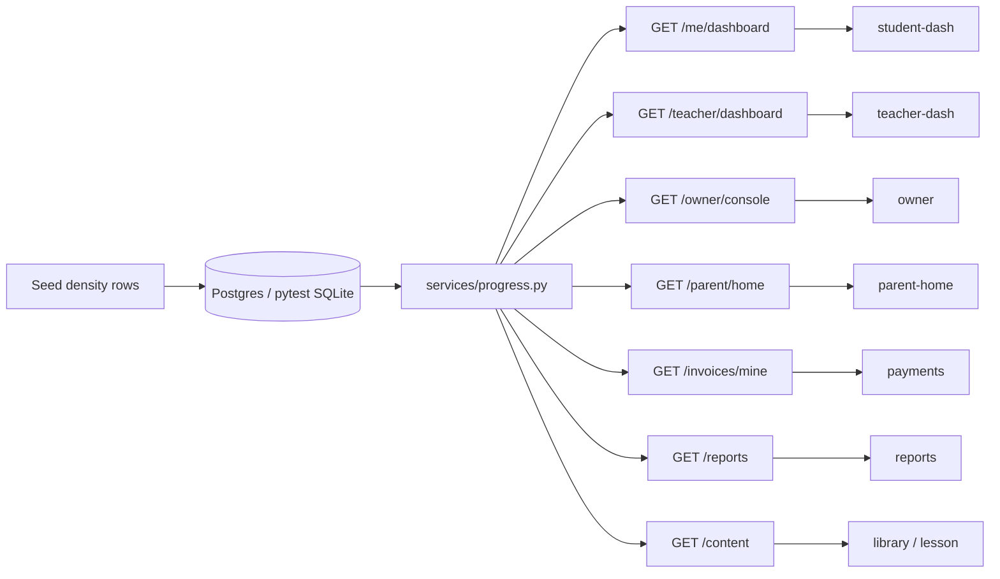

# 005 action items — dashboard density

| | |
|---|---|
| **Status** | Specified · pending implement |
| **Spec** | [spec.md](spec.md) · [plan.md](plan.md) |
| **Rule** | Same 47 screen ids. Same `/api/v1` paths. Named facts, not counts. |
| **Branch** | `cursor/005-dashboard-density` when implementing — never `main` |
| **Do not** | Invent a 48th screen · live Razorpay · marketplace · Biology-only product |

004 wired the routes. This list fills the **picture of a running academy** so the live app matches demo gold (and does not look hollow next to a coaching OS landing page).

---

## Gate (blocks `/speckit.implement`)

- [x] Human confirmed the iSeekAcademy density gap (2026-09-06)
- [x] Spec + plan + this task list written
- [ ] Human OK to implement **this** list (separate from specify)
- [ ] Branch is not `main` / `master`

---

## What “done” looks like on each screen

| Screen | Hollow today | Done = demo-shaped |
|---|---|---|
| `student-dash` | N sessions, N attempts | Tonight **title + time**, DPP unanswered/total, this-week test, doubt outcome, weak tags |
| `teacher-dash` | sessions / students / attempts | Attendance %, weekday **bars**, completion by set, named **chase** list |
| `owner` | quota used/cap | Scorecard (sessions, students, practice %, SLA, revenue, churn) **plus** quotas |
| `parent-home` | five links | 5/6 attendance, latest practice, latest test, fee due **date** |
| `payments` | amount + status | Due card, receipt history, paid / pending / overdue |
| `library` | title + body | Kind, duration, progress bar, search chips |
| `lesson` | fake play box | Notes, duration, next practice |
| `reports` | `[]` or id dump | Term slice: attendance, practice, test, teacher note |

---

## P7 — Backend workflow

Phase id: `005-density`. Stop if 002 pytest goes red.

### T7.1 — Seed named operating facts

- **Owner:** Backend
- **Complexity:** M
- **Depends:** catalog seed pack on this branch
- **Critical:** yes
- **AC:** 9, 11
- **Files:** `backend/app/services/seed_pack.py` (or `seed_density.py` called from it), `seed-map.html`
- **Commands:** `cd backend; python -m app.seed_cli --reset`
- **Do:** upcoming named session; due practice set; historical week attendance; one at-risk student; open + answered doubt; content `kind` + notes; one paid invoice with receipt, one pending with `due_on`.
- **Do not:** pre-write attendance for a live class that has not been joined.
- **Risks:** Empty dashboards after reset. Biology names allowed only as tenant topic copy.

### T7.2 — Progress service (aggregates in one place)

- **Owner:** Backend
- **Complexity:** L
- **Depends:** T7.1
- **Critical:** yes
- **AC:** 8, 10
- **Files:** `backend/app/services/progress.py` (new), thin calls from `extras.py` / `owner.py` / `parent.py`
- **Commands:** `cd backend; python -m pytest`
- **Do:** one function per dashboard; `workspace_id` on every query; parent scoped to linked child.
- **Do not:** put SQL in routers; add tables; add `/api/v1` paths.
- **Risks:** N+1 queries; leaking workspace B.

### T7.3 — Enrich `GET /api/v1/me/dashboard`

- **Owner:** Backend
- **Complexity:** M
- **Depends:** T7.2
- **Critical:** yes
- **AC:** 1, 10
- **Files:** `extras.py` student_dash, `progress.py`
- **Keep** existing keys. **Add** `next_session`, `due_practice`, `this_week`, `doubt`, `weak_tags` (see plan.md).

### T7.4 — Enrich `GET /api/v1/teacher/dashboard`

- **Owner:** Backend
- **Complexity:** M
- **Depends:** T7.2
- **Critical:** yes
- **AC:** 2, 10
- **Files:** `extras.py` teacher_dash, `progress.py`
- **Add** `cohort`, `attendance_pct`, `attendance_week`, `practice_by_set`, `doubt_backlog`, `at_risk`.

### T7.5 — Enrich `GET /api/v1/owner/console`

- **Owner:** Backend
- **Complexity:** M
- **Depends:** T7.2
- **Critical:** yes
- **AC:** 3, 10
- **Files:** `owner.py`, `progress.py`
- **Keep** `usage`. **Add** `scorecard`, `teachers`, `cohort_pnl`.

### T7.6 — Enrich parent, invoices, reports, content

- **Owner:** Backend
- **Complexity:** M
- **Depends:** T7.2
- **Critical:** yes
- **AC:** 4, 5, 6, 7, 10
- **Files:** `parent.py`, `extras.py` invoices/reports/content
- **Add** parent numeric slices; invoice `due_on` / `receipt_id`; reports term slice; content `kind` / `duration_label` / `progress_pct` / lesson `notes`.

---

## P7 — Frontend (same ids)

### T7.7 — Student home + library + lesson

- **Owner:** Frontend
- **Complexity:** L
- **Depends:** T7.3, T7.6
- **Critical:** yes
- **AC:** 1, 6
- **Files:** `StudentDashScreen.tsx`, `LibraryScreen.tsx`, `LessonScreen.tsx`
- **Commands:** `cd frontend; npm run check-routes`
- **Do:** copy demo card structure (hot cards, chips, progress bar). Tokens from demo CSS.
- **Do not:** invent routes or a 48th screen.

### T7.8 — Teacher dashboard

- **Owner:** Frontend
- **Complexity:** M
- **Depends:** T7.4
- **Critical:** yes
- **AC:** 2
- **Files:** `TeacherDashScreen.tsx`
- **Do:** `stat` grid + CSS `bars` + chase rows to `timeline`. Match demo `R['teacher-dash']`.

### T7.9 — Owner, parent, payments, reports

- **Owner:** Frontend
- **Complexity:** L
- **Depends:** T7.5, T7.6
- **Critical:** yes
- **AC:** 3, 4, 5, 7
- **Files:** `OwnerScreen.tsx`, `ParentHomeScreen.tsx`, `PaymentsScreen.tsx`, `ReportsScreen.tsx`
- **Do:** scorecard + quotas; parent numbers; due card + receipts; term marksheet.
- **Do not:** live checkout; second gradebook ids.

---

## P7 — Prove and absorb

### T7.10 — Density tests + 002 gate

- **Owner:** Test and QA
- **Complexity:** M
- **Depends:** T7.3, T7.4, T7.5, T7.6
- **Critical:** yes
- **AC:** 8, 12
- **Files:** `backend/tests/test_005_density.py` (new), existing isolation tests
- **Commands:** `cd backend; python -m pytest`
- **Risks:** Red 002 is a stop. `live_calls == 0`.

### T7.11 — Catalog + product map

- **Owner:** Integration and Docs
- **Complexity:** S
- **Depends:** T7.7, T7.8, T7.9
- **Critical:** true
- **AC:** 13
- **Files:** `scripts/build_catalog.py` `shows`, demo WHY, `README.md` §11–§12, `product-viewer.html`, `work-log.html`
- **Commands:** `python scripts/build_catalog.py`
- **Do:** `shows` text must mention named facts. Hub tiles T7.* → done.

### T7.12 — Tester converge + PM Accept

- **Owner:** Test and QA + PM
- **Complexity:** S
- **Depends:** T7.10, T7.11
- **Critical:** yes
- **AC:** 13
- **Files:** `specs/005-dashboard-density/test-report.md`, README §12
- **Commands:** `/speckit.converge`
- **Risks:** Accept only if wired UI matches demo density on the eight screens.

---

## Out of this list (do not sneak in)

| Tempting extra | Why not |
|---|---|
| Public branded academy homepage | Not a catalog screen; needs its own spec |
| Find-a-tutor marketplace | Different product |
| Certificates / leads / AI papers | No screen id |
| Live Razorpay | Port stays mock |
| Chart.js / new design system | Demo CSS bars are gold |

---

## Critical path

`T7.1 → T7.2 → T7.3 / T7.4 / T7.5 / T7.6 → T7.7 / T7.8 / T7.9 → T7.10 → T7.11 → T7.12`
